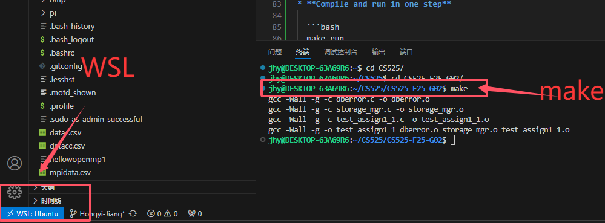
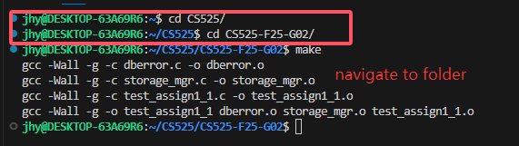
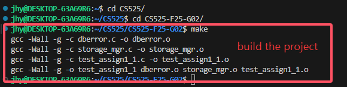
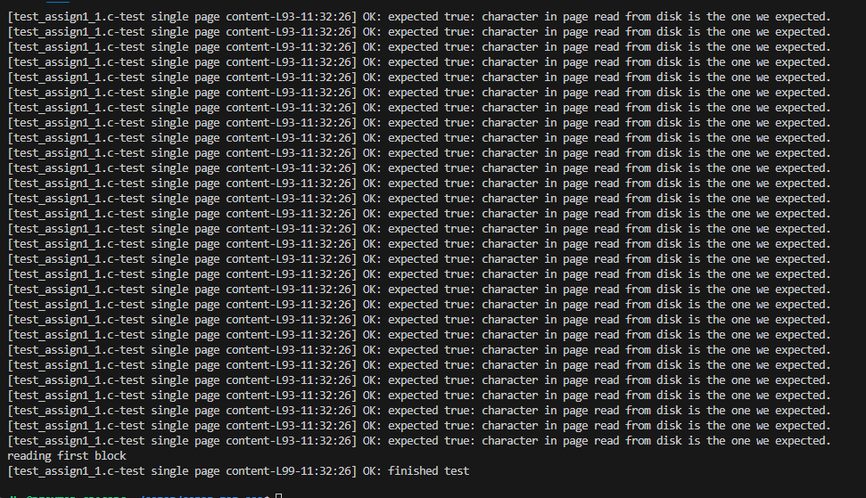
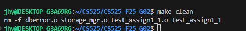

# CS525-F25-G02

## 1. File Introduction

For this assignment, the main modifications were made to the following files:
- **Makefile**  
- **storage_mgr.c**  
- **README.md**

### Overview of Files in the Project

1. **Makefile**  
   Used to compile the project. It builds the binary `test_assign1_1` from `test_assign1_1.c`, together with `dberror.c` and the storage manager implementation files. It also includes targets for cleaning build files and running the program.

2. **storage_mgr.c**  
   This is the core implementation file for the storage manager. It defines the functions declared in `storage_mgr.h`, including creating, opening, reading, writing, and destroying page files. It also implements helper functions for ensuring file capacity and appending new pages.

3. **storage_mgr.h**  
   Header file for the storage manager. It declares the public interface that `storage_mgr.c` implements.

4. **dberror.c / dberror.h**  
   Utility files for error handling. They define error codes and provide helper functions for printing and debugging error messages.

5. **test_assign1_1.c**  
   Contains provided test cases for verifying the implementation of the storage manager. The Makefile compiles this file into the test executable.

6. **test_helper.h**  
   A helper header file used by `test_assign1_1.c` for testing convenience. It provides macros and utility functions to simplify writing and running tests.

7. **README.md**  
   This document. It describes the solution, design, and instructions for building and running the project.


## 2. Design and Implementation of Functions

### Creating and Managing (Create, Open, Close, Destroy) 
1. **createPageFile** : To create a brand new file, which includes one header page and one normal page.

   First, fopen(fileName, "wb+") physically creates the file. The "wb+" means "write in binary mode." The w creates a new file, and the + allows us to read from it as well.

   Next, we create the first page (page 0), which is a header page, storing information about the file itself, such as the total number of pages in the file (totalNumPages). We create a block of memory (malloc), write the total number of pages (which is 1) into it, and then write this header page to the file.

   Then, we create another empty block of memory and write it to the file right after the header. Now our file has two pages: the header and the first data page. We have a fixed PAGE_SIZE, which means every page is the exact same size.
   
   Finally, we clean up by freeing any memory we used and closing the file.

2. **openPageFile** : To open an existing file.

   First, fopen(fileName, "rb+") opens the file. The "rb+" means "read in binary mode," and the + allows us to write later. If the file doesn't exist, fopen(fileName, "rb+") will fail.

   Next, we read the first page (the header) from the file and get the totalNumPages that we stored there when we created the file, which is the total pages number the file have.

   Finally, we set up our "file handle" (fHandle). These infomration can be access later: file name, the total number of pages, and the current under reading page number (default to hearder page number).

3. **closePageFile** : To safely close the file. The dangling pointers are avoided.
4. **destroyPageFile** : To delete the file from the computer entirely.

### Reading (Read Functions)
1. **readBlock** : To jump to a specific page number and read it

   First, we check if the page number valid. Since page 0 is the header, the actual data for pageNum is at (pageNum + 1) * PAGE_SIZE.

   Next, we use fseek() to jump the file's "read cursor" directly to that location and then use fread() to copy one page's data from the file into the memPage buffer.

   Finally, we update our fHandle->curPagePos to remember that this is the page we last stopped.

2. **readFirstBlock** : To get the first page number, and then call the **readBlock** function to do the work.
3. **readPreviousBlock** : To get the current page number, minus 1, and then call the **readBlock** function to do the work. 
4. **readNextBlock** : To get the current page number, add 1, and then call the **readBlock** function to do the work.
5. **readLastBlock** : To get the totalNumPages, minus 1, and then call the **readBlock** function to do the work.

### Writing (Write and Append Functions)
1. **writeBlock** : It is the mirror image of readBlock. 
   First, we check if the page number valid.
   Next, we calculate the position using (pageNum + 1) * PAGE_SIZE, and then use fseek() to jump there. 
   Finally, we use fwrite() to write the data to the file from the memPage buffer.

2. **appendEmptyBlock** : To add a new page at the end of the file.

   First, we create a completely empty page (filled with zeros) in memory.

   Next, we use fseek(file, 0, SEEK_END) to jump to the end of the file.

   Then, the new empty page is written there.

   Finally, we increase the totalNumPages in the file handle by 1 and update the number in the header page also by 1.

3. **ensureCapacity** : To check the current total pages and call appendEmptyBlock in a loop until the file is big enough.


## 3. How to Build and Run

### Prerequisites
- **Linux / macOS**  
  Requires `gcc` and `make` (these are usually pre-installed or can be installed easily with package managers such as `apt` or `yum`).

- **Windows**  
  In our setup, we use **WSL (Windows Subsystem for Linux)** with Ubuntu as the development environment.  
  This allows us to run `gcc` and `make` just like on Linux.  

  Example of using WSL and running `make` inside WSL:  
    

### Build Instructions
1. Open a terminal (Linux/macOS) or a WSL terminal (Windows).
2. Navigate to the project directory:
   ```bash
   cd CS525-F25-G02
   ```

3. Run the following command to build the executable:

   ```bash
   make
   ```

   This compiles the source files (`dberror.c`, `storage_mgr.c`, `test_assign1_1.c`) and generates the executable **`test_assign1_1`**.

4. Run the program after building:

   ```bash
   ./test_assign1_1
   ```

### Additional Targets

1. **Clean build files**

  ```bash
  make clean
  ```

  Removes all `.o` files and the compiled binary.

2. **Compile and run in one step**

  ```bash
  make run
  ```

  Builds the project and immediately executes `./test_assign1_1`.


## 4. Demonstration of Execution

This section demonstrates how to build, run, and clean the project.  
All commands are executed inside the project directory (`/CS525/CS525-F25-G02`) using WSL.

### Step 1: Navigate to the project folder
```bash
cd CS525/
cd CS525-F25-G02/
```



### Step 2: Build the project with `make`

```bash
make
```



### Step 3: Execute the test program

```bash
./test_assign1_1
```



### Step 4: Clean build files

```bash
make clean
```




## 5. Video Link
[The link to the recorded demo video.](https://www.loom.com/share/70a06945834d4cce944e274a8c6ec885?sid=453fc0af-bc86-4eab-b260-0cb5e2de8707)


## 6. Contact Authors

* **Hongyi Jiang** (A20506636)
* **Naicheng Wei** (A20278475)

If you have any questions, feel free to contact us at: **[jiangxiaobai1142@gmail.com](mailto:jiangxiaobai1142@gmail.com)** **[lwei3@ghawk.illinoistech.edu](mailto:lwei3@ghawk.illinoistech.edu)**


