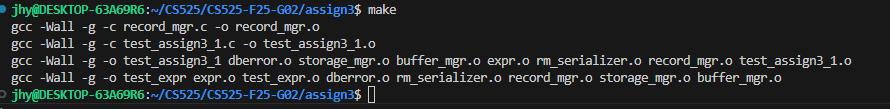

# CS525-F25-G02 Assignment 3 (not finished yet)

## 1. File Introduction

For this assignment, the main modifications were made to the following files:
- **Makefile**  
- **record_mgr.c**  
- **README.md**

### Overview of Files in the Project

1. **Makefile**  
   Used to compile the project. It builds the test binaries (`test_assign3_1`) from their respective `.c` files, together with the common sources. It also provides targets for compilation, execution, and cleanup.

2. **record_mgr.c**  
   Implements the Record Manager API specified in `record_mgr.h`. It handles table creation, record insertion/deletion/update, schema serialization, and tuple scanning.
   
3. **buffer_mgr.c / buffer_mgr.h**  
   These files from the 2nd assignment provid the buffer pool layer used by the record manager to read and write pages. 

4. **storage_mgr.c / storage_mgr.h**
   These files from the 1st assignment provide the underlying storage layer. Implements the page-level file I/O operations.

5. **dberror.c / dberror.h**  
   Utility files for error handling. They define error codes and provide helper functions for printing and debugging error messages.

6. **expr.c / expr.h**  
   Implements the expression evaluation `evalExpr` used by table scans.
   
7. **tables.h**  
   Provide the `Schema`, `Record` and other structures and utility functions for attribute handling.

8. **test_assign3_1.c**  
   Contains provided test cases for verifying the implementation, including creation, insertion, update, scan tests. The Makefile compiles these files into the test executable.

9. **test_helper.h**  
   A helper header file used by `test_assign3_1.c` for testing convenience. It provides macros and utility functions to simplify writing and running tests.

10. **README.md**  
   This document. It describes the solution, design, and instructions for building and running the project.

## 2. Design and Implementation of Functions

### 2.1 Core Design

Page 0: Metadata (num tuples, first free page, and serialized schema)
Pages 1 – N: Actual records, where each slot is 1 byte (tag) + recordSize bytes (data)

#### Key Structures

typedef struct TableMgmtData {
    BM_BufferPool *bm;
    int numTuples;
} TableMgmtData;

typedef struct RM_PageInfo {
    int freeSlots;  
} RM_PageInfo;

typedef struct ScanMgmtData {
    int currentPage;
    int currentSlot;
    Expr *cond;
    BM_PageHandle ph;
} ScanMgmtData;

### 2.2 Function Descriptions
TODOTODOTODOTODOTODOTODOTODOTODOTODOTODOTODOTODOTODOTODOTODOTODOTODOTODOTODOTODOTODOTODOTODOTODOTODOTODOTODOTODOTODOTODOTODOTODOTODOTODOTODOTODOTODOTODOTODOTODO
#### Pool Handling (init, shutdown, flush) 
1. **initBufferPool** : To create a new buffer pool in memory, which includes a specified number of page frames.
First, it allocates memory for a `PoolMgmtData` struct, which holds all keeping information for the pool.
Next, it allocates an array of `Frame` structs, one for each page frame in the pool. Each frame is initialized with default values: `pageNum` is set to `NO_PAGE`, `dirty` is `false`, `fixCount` is 0, and memory is allocated for the page data itself.
Finally, it sets up the `BM_BufferPool` handle passed by the page file name, number of pages, and chosen replacement strategy.

2. **shutdownBufferPool** : To safely destroy the buffer pool and free resources. It writes dirty pages back to the disk file. This is similar to calling `forceFlushPool`. Then, it frees all allocated memory, including the data buffer for each frame, the array of frames, and the `PoolMgmtData` struct itself.

3. **forceFlushPool** : To write all dirty pages from the buffer pool to disk. It iterates through all frames and writes the content back to the page file for any frame that is dirty and not pinned.

#### Page Access (pin, unpin, mark, force)
1. **pinPage** : To request a page from the page file and "pin" it in a frame in memory.
- First, it checks whether the requested page is already present in the buffer pool.
  - If yes, it increments the frame's `fixCount` and updates the replacement information (for example, reference counter, reference bit, or access history depending on the chosen strategy).
- If the page is not already in memory, the buffer manager must select a frame for replacement.
  - If there are still empty frames (`pageNum == NO_PAGE`), it uses one directly.
  - Otherwise, it applies the current replacement strategy (FIFO, LRU, CLOCK, LFU, or LRU-K) to select a victim frame.
- Before replacing, if the victim frame contains a dirty page, its content is written back to disk.
- Then, the new page is read from disk into the victim frame, and the metadata is updated (`pageNum`, `fixCount`, `dirty`, and replacement info).
- Finally, the `BM_PageHandle` is updated so the caller can access the page's data.


2. **unpinPage** : To notify the buffer manager that the usage is finished with a page. It finds the corresponding frame and decrements its `fixCount` by one. If the page is not in the pool or its `fixCount` is already 0, an error is returned.

3. **markDirty** :  To mark a page in the buffer as having been modified. It finds the corresponding frame and sets its `dirty flag` to true. If the page is not found in the buffer pool, it returns an error.

4. **forcePage** : To write the current content of a specific page back to the disk. If the page is not in the pool, or the buffer pool is not initialized, it returns an error.


#### Statistics (get functions)
1. **getFrameContents** : To get an array of page numbers representing the content of the buffer pool. It returns an array where the i-th element is the page number stored in the i-th frame.

2. **getDirtyFlags** : To get an array of booleans. The i-th element is true if the page in the i-th frame is dirty.

3. **getFixCounts** : To get an array of integers. The i-th element is the `fixCount` of the page in the i-th frame.

4. **getNumReadIO** : To get the total number of pages read from disk.

5. **getNumWriteIO** : To get the total number of pages written to disk.

### 2.3 Other Modifications

In addition to implementing the core buffer manager functionality, we introduced several small but necessary modifications to support the new replacement strategies and error handling:

1. **New data structures**

   i. **`Frame`**: Represents a single page frame in the buffer pool. We extended it with two additional fields:

     * `ref` – an integer counter used for the LRU/LFU strategies.
     * `refBit` – a reference bit used for the CLOCK strategy.

   ii. **`PoolMgmtData`**: Stores management information for the buffer pool, including pointers to frames, counters for I/O operations, and helper pointers for replacement strategies .

   iii. **`LRUKData`**: A dedicated structure to store access histories for the LRU-K strategy. It maintains a `histories` array for K timestamps per frame and a `historyCount` array to track how many accesses are recorded.

   In addition, we defined a **global counter (`globalLRUCounter`)** that is incremented on every access, ensuring proper ordering of page references for both LRU and LRU-K.

2. **New error codes**

   `RC_PINNED_PAGES_IN_BUFFER (400)`: Returned when all frames are pinned, and no victim can be selected for replacement.

   `RC_BUFFER_POOL_NOT_INIT (5)`: Returned when a buffer pool function is called without proper initialization.

   These changes were necessary because the original error codes in `dberror.c` did not fully cover the specific cases in our buffer manager implementation.


### 2.4 Additional Test Cases

We also extended the test suite by adding a new test program (`test_assign2_n.c`). This test specifically validates the **CLOCK** and **LFU** replacement strategies, which were not covered in the original test cases. 

## 3. How to Build and Run

### Prerequisites
- **Linux / macOS**  
  Requires `gcc` and `make` (these are usually pre-installed or can be installed easily with package managers such as `apt` or `yum`).

- **Windows**  
  In our setup, we use **WSL (Windows Subsystem for Linux)** with Ubuntu as the development environment.  
  This allows us to run `gcc` and `make` just like on Linux.  

  Example of using WSL and running `make` inside WSL:  

  

### Build Instructions
1. Open a terminal (Linux/macOS) or a WSL terminal (Windows).
2. Navigate to the project directory:
   ```bash
   cd CS525-F25-G02/assign2
   ```

3. Run the following command to build the executable:

   ```bash
   make
   ```

   This compiles the source files and generates the executable **`test_assign2_1`** ， **`test_assign2_2`** and **`test_assign2_n`**.

### Run Tests:
Builds the project and executes the test cases.

#### Using make
1. Run the main test case (FIFO and LRU):
   ```bash
   make run1
   ```
2. Run the second test case (for optional strategies):
   ```bash
   make run2
   ```
3. Run the third test case (CLOCK and LFU strategies):
   ```bash
   make runn
   ```
#### Run executables directly

1. Run test 1:

   ```bash
   ./test_assign2_1
   ```
2. Run test 2:

   ```bash
   ./test_assign2_2
   ```
3. Run test n:

   ```bash
   ./test_assign2_n
   ```

### Additional Targets

1. **Clean build files**

  ```bash
  make clean
  ```

  Removes all `.o` files and the compiled binary.

## 4. Demonstration of Execution

This section demonstrates how to build, run, and clean the project.  
All commands are executed inside the project directory (`/CS525/CS525-F25-G02/assign2`) using WSL.

### Step 1: Navigate to the project folder
Before compiling, make sure you are inside the `assign2` folder of the repository.

```bash
cd CS525/
cd CS525-F25-G02/
cd assign2
```


### Step 2: Build the project with `make`

Run the following command to compile the source code:

```bash
make
```
This will build all object files (`.o`) and generate executables for the test cases (`test_assign2_1`, `test_assign2_2`, and `test_assign2_n`).


### Step 3: Execute the test programs using the run targets

There are **two ways** to run the tests:

   #### Option A. Use `make run` Targets

   The Makefile defines custom targets for running each test case:

   ```bash
   make run1    # runs test_assign2_1
   make run2    # runs test_assign2_2
   make runn    # runs test_assign2_n
   ```

   <p align="left">
      
   </p>


   #### Option B. Run Executables Directly

   You can also execute the compiled binaries directly:

   ```bash
   ./test_assign2_1
   ./test_assign2_2
   ./test_assign2_n
   ```

   


### Step 4: Clean build files

To remove all compiled files and reset the build environment, run:

```bash
make clean
```
This deletes all object files and executables so you can rebuild from scratch.


## 5. Video Link

  [The link to the recorded assignment 2 demo video. ](https://www.loom.com/share/28bb0049b54b4926a9f1225e6673a436?sid=7db313b1-befd-4d76-8420-152b394b19dd)

## 6. Contact Authors

* **Hongyi Jiang** (A20506636)
* **Naicheng Wei** (A20278475)

If you have any questions, feel free to contact us at: **[jiangxiaobai1142@gmail.com](mailto:jiangxiaobai1142@gmail.com)** **[lwei3@ghawk.illinoistech.edu](mailto:lwei3@ghawk.illinoistech.edu)**
