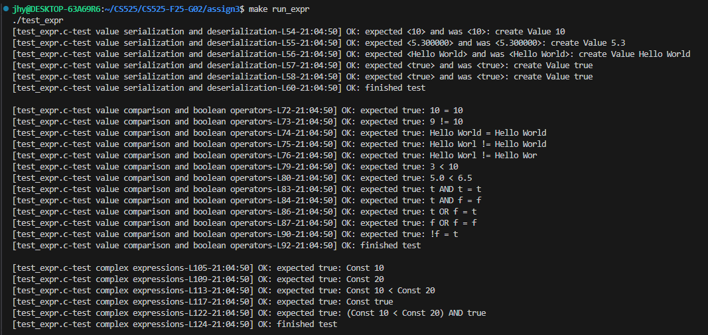
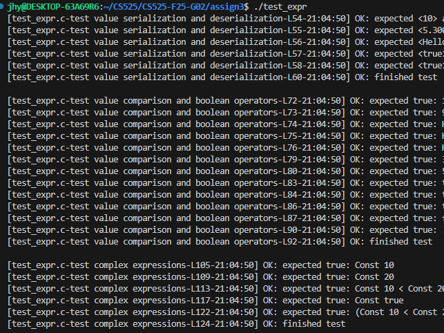
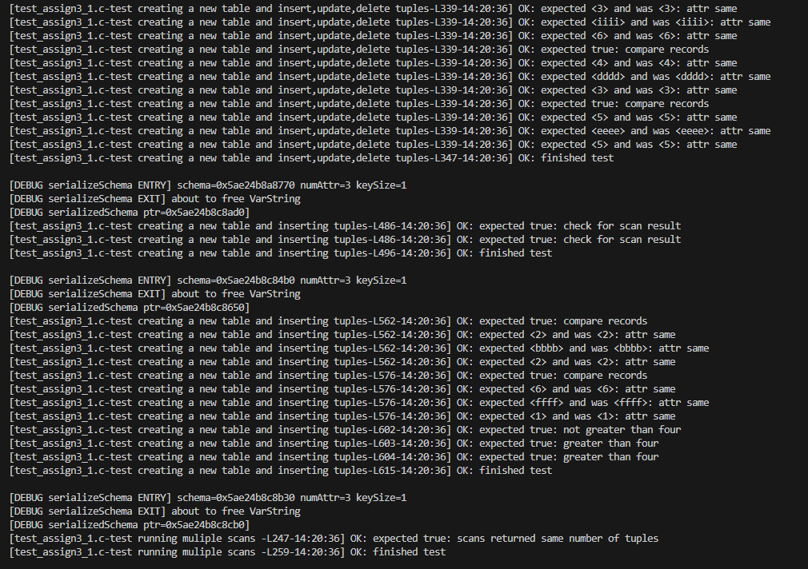

# CS525-F25-G02 Assignment 3 

## 1. File Introduction

For this assignment, the main modifications were made to the following files:
- **Makefile**  
- **record_mgr.c**  
- **README.md**

### Statement
We only completed the basic requirements and did not implement the extra credit parts.

### Overview of Files in the Project

1. **Makefile**  
   Used to compile the project. It builds the test binaries (`test_assign3_1`, `test_expr`) from their respective `.c` files together with the common sources. It also provides targets for compilation, execution, and cleanup.

2. **record_mgr.c**  
   Implements the Record Manager API specified in `record_mgr.h`. It handles table creation, record insertion/deletion/update, schema serialization, and tuple scanning.
   
3. **buffer_mgr.c / buffer_mgr.h**  
   These files from the 2nd assignment provid the buffer pool layer used by the record manager to read and write pages. 

4. **storage_mgr.c / storage_mgr.h**
   These files from the 1st assignment provide the underlying storage layer. Implements the page-level file I/O operations.

5. **dberror.c / dberror.h**  
   Utility files for error handling. They define error codes and provide helper functions for printing and debugging error messages.

6. **expr.c / expr.h**  
   Implements the expression evaluation `evalExpr` used by table scans.
   
7. **tables.h**  
   Provide the `Schema`, `Record` and other structures and utility functions for attribute handling.

8. **rm_serializer.c**
   Implements serialization functions declared in `tables.h`, converting table schemas, records, and values into readable string representations for debugging and testing purposes.

9. **test_expr.c**
   Contains test cases for verifying expression evaluation functions defined in `expr.c`. It checks comparison, boolean, and nested operator correctness.
   The **Makefile** compiles this file into a separate test executable (`test_expr`) used to validate the expression module independently.

10. **test_assign3_1.c**
   Contains provided test cases for verifying the record manager implementation, including creation, insertion, update, and scan tests. The Makefile compiles this into the main test executable.

11. **test_helper.h**
   A helper header file used by test programs for testing convenience. It provides macros and utility functions to simplify writing and running tests.

12. **README.md**
   This document. It describes the solution, design, and instructions for building and running the project.

## 2. Design and Implementation of Functions

### 2.1 Core Design

The Record Manager is built on top of the Buffer Manager and Storage Manager layers. It utilizes these two components to manage tables, pages, and records efficiently.

#### Page Layout
- **Page 0** — Stores table metadata:  
  number of tuples, first free page index, and the serialized schema.  
- **Pages 1–N** — Store actual records.  
  Each slot in a page contains a **1-byte tag** (`'1'` = valid, `'0'` = free) followed by the record data.

#### Functional Overview
The Record Manager supports the following operations:
- Creating and opening tables  
- Inserting, deleting, updating, and reading records  
- Scanning tables with optional conditions (using `evalExpr()`)

Each table is represented by an `RM_TableData` structure that stores the schema and a pointer to its management data (`TableMgmtData`).  
Scanning operations are handled through a `ScanMgmtData` structure, which keeps track of the current page, slot, and selection condition during iteration.

#### Defined Structures

1. TableMgmtData: Represents per-table metadata maintained by the Record Manager.
It contains:
   - BM_BufferPool *bm; a pointer to the buffer pool used to manage the table's pages.
   - int numTuples; total number of tuples currently in the table (read from page 0 metadata).

2. RM_PageInfo : Represents information about a single data page.
It contains:
   - int freeSlots; the number of free record slots in that page. 

3. ScanMgmtData : Stores metadata for an ongoing table scan operation.
It contains:
   - int currentPage; current page number being scanned.
   - int currentSlot; current slot index within the page.
   - Expr *cond; pointer to the selection condition `(Expr *)` used by `evalExpr()`.
   - BM_PageHandle ph; a `BM_PageHandle` struct for the currently pinned page in buffer.

### 2.2 Function Descriptions

#### Initialization and Shutdown 

1. **initRecordManager** : Initializes the record manager module.
Since no global state or configuration data are needed for this assignment, this function simply returns `RC_OK` to indicate successful initialization.

2. **shutdownRecordManager** : Shuts down the record manager.
This function also returns `RC_OK`, because the record manager does not allocate any global memory or background resources.

#### Table Management

1. **createTable** : Creates a new table on disk and initializes its metadata.
- Calls `createPageFile()` to create an empty page file.
- Initializes a buffer pool for this file using `initBufferPool()`.
- Writes metadata to page 0 which stores the table metadata.
- The schema is serialized using `serializeSchema()` and written into the page.
- Marks the page dirty, forces it to disk, unpins it, and shuts down the buffer pool.
  
2. **openTable** : Opens an existing table and loads its schema from disk.
- Initializes a buffer pool for the table file.
- Pins page 0 and reads metadata from the page content.
- Parses the schema string using `parseSchemaString()` to rebuild the `Schema *`.
- Allocates and fills the `RM_TableData` structure (table name, parsed schema, pointer to `TableMgmtData` containing buffer pool and tuple count)
- Unpins page 0 and returns `RC_OK`.
  
3. **closeTable** :  Closes the opened table and releases its resources.
- Flushes all dirty pages to disk with `forceFlushPool()`.
- Shuts down the buffer pool with `shutdownBufferPool()`.
- Frees the memory of `BM_BufferPool` and `TableMgmtData`.

4. **deleteTable** : Deletes the page file representing the table using `destroyPageFile()`.
   
5. **getNumTuples** : Returns the number of tuples currently stored in the table, as recorded in the `numTuples` field of `TableMgmtData`.

#### Record Operations

1. **createRecord** : Allocates and initializes a new record structure.
- Computes record size using `getRecordSize()`.
- Allocates memory for the `Record` struct and its `data` buffer.
- Initializes the record’s RID to {page=-1, slot=-1}.
  
2. **freeRecord** : Releases the memory allocated for a record. If the record is `NULL`, the function also safely returns `RC_OK`.

3. **insertRecord** : Inserts a new record into the table.
- Calculates slot size (slotSize = recordSize + 1). A extra one byte was added for tag.
- Scans data pages starting from page 1, because page 0 is metadata.
- Pins a page with `pinPage()`.
- If the page does not exist, uses `ensureCapacity()` to allocate it and fills it with '0'.
- Finds the first free slot ('0' or '\0').
- Writes '1' to mark it occupied and copies record data into the slot.
- Updates the record’s RID (page and slot).
- Marks the page dirty, unpins it, and increments `numTuples`.

4. **deleteRecord** : Deletes a record by marking its slot as empty.
- Pins the page containing the record.
- Calculates the record’s offset and sets the slot tag to '0'.
- Clears the record’s data region.
- Marks page dirty, unpins the page, and decrements `numTuples`.

5. **updateRecord** : Overwrites an existing record with new data.
- Pins the page specified by the record’s RID.
- Calculates the byte offset within the page.
- Performs a boundary check: if offset + slotSize > PAGE_SIZE → the record cannot be updated.
- Writes '1' to the tag and copies the new record data.
- Marks the page dirty and unpins it.

6. **getRecord** : Retrieves a record by its RID.
- Pins the page containing the record.
- Computes offset = id.slot * (recordSize + 1).
- Performs boundary check and verifies that the slot tag == '1'.
- Copies the record data from page to memory.
- Unpins the page and returns `RC_OK`.

#### Attribute Access

1. **getAttr** : Retrieves the value of a specific attribute in a record.
- Computes byte offset for the attribute based on preceding fields and data types.
- Reads data from the record into a new `Value` struct.
- Handles each data type (`INT`, `FLOAT`, `BOOL`, `STRING`) separately.
- For `STRING`, copies exactly `typeLength` characters and ensures null-termination.

2. **setAttr** : Sets the value of a specific attribute in a record.
- Computes byte offset of the target attribute.
- Writes the new value into the record’s data buffer.
- For `STRING`, clears the old bytes, copies new data, and appends '\0'.
 
#### Scanning Tuples

1. **startScan** : Starts a new sequential table scan with an optional condition.
- Allocates a `ScanMgmtData` struct.
- Initializes fields: currentPage = 1, currentSlot = 0, cond = cond (the filter condition), ph = empty page handle
- Links this scan context to `RM_ScanHandle` for subsequent iteration.

2. **next** : Retrieves the next record that satisfies the scan condition.
- Pins the current page.
- Iterates through all slots: skips empty slots (tag '0'); loads record data for valid slots; if `cond == NULL`, returns `RC_OK`; otherwise, evaluates `cond` using `evalExpr(record, schema, cond, &result)`; if the condition is true, returns the record.
- After finishing a page, unpins it and moves to the next page.
- Returns `RC_RM_NO_MORE_TUPLES` when all pages are scanned.

3. **closeScan** : Closes a scan handle and releases its resources.
- Unpins any pinned page.
- Frees the `ScanMgmtData` structure.
- Resets the handle fields to `NULL`.
 
#### Schema Management

1. **getRecordSize** : Computes the total size (in bytes) required to store a single record.
- Iterates through all attributes in the schema and sums up the byte size of each type.
- Handles `INT`, `FLOAT`, `BOOL`, and `STRING` types appropriately.
- Returns 0 if the schema pointer is invalid.

2. **createSchema** : Creates and initializes a new schema.
- Copies all attribute names, data types, and type lengths into dynamically allocated arrays.
- Allocates and copies key attributes if `keySize > 0`.
- Returns a pointer to the new schema structure.

3. **freeSchema** : Releases memory allocated for the schema.
- Frees each `attrName`, and arrays of `dataTypes`, `typeLength`, and `keyAttrs`.
- Safely returns `RC_OK` even if the input pointer is `NULL`.

#### Supporting Functions

1. **parseSchemaString** : Reconstructs a schema structure from a serialized string stored in page 0.
- Reads the number of attributes and allocates arrays.
- Parses triplets (attrName, dataType, length) separated by spaces.
- Extracts key attributes and sets `keyAttrs` and `keySize`.
- Returns the rebuilt `Schema *`.

2. **serializeSchema** : Serializes a `Schema` into a single string for writing to page 0.
- Concatenates attribute names, data types, and key attributes in a readable format.
- This string is later written into the metadata page and parsed back when opening the table.

### 2.3 Error and Boundary Handling

- Every major function starts with null pointer checks.
- Functions using page handles (pinPage) add unpin calls before early returns to avoid leaks.
- `getRecord()` and `updateRecord()` contain boundary checks (offset + slotSize > PAGE_SIZE) to avoid segfaults.

## 3. Design Highlights and Improvements

1. **Safe Pin/Unpin Mechanism** – Every `pinPage()` has a matching `unpinPage()` even in error branches.

2. **Record Tagging** – Each slot uses a 1-byte flag ('1' = valid, '0' = free).

3. **Schema Serialization** – Schema is stored as a single string on page 0 and reconstructed with `strtok()`.

4. **Full Test Compatibility** – All tests from `test_assign3_1.c` and `test_expr.c` pass.

5. **Robust Boundary Checks** – Prevent page overflow and leakage when invalid RID is given.

   
## 4. How to Build and Run

### Prerequisites
- **Linux / macOS**  
  Requires `gcc` and `make` (these are usually pre-installed or can be installed easily with package managers such as `apt` or `yum`).

- **Windows**  
  In our setup, we use **WSL (Windows Subsystem for Linux)** with Ubuntu as the development environment.  
  This allows us to run `gcc` and `make` just like on Linux.  

  Example of using WSL and running `make` inside WSL:  

   

### Build Instructions
1. Open a terminal (Linux/macOS) or a WSL terminal (Windows).
2. Navigate to the project directory:
   ```bash
   cd CS525-F25-G02/assign3
   ```

3. Run the following command to build the executable:

   ```bash
   make
   ```

   This compiles all source files and generates **two executables**:

   * **`test_assign3_1`** – tests the Record Manager implementation.
   * **`test_expr`** – tests the Expression Evaluation module.

### Run Tests:
Builds the project and executes the test cases. You can run either the Record Manager tests or the Expression tests.

#### Using make
Run the Record Manager test:
   ```bash
   make run
   ```

Run the Expression Evaluation test:

```bash
make run_expr
```

#### Run executables directly
You can also run the compiled executables manually:

   ```bash
   ./test_assign3_1    # Record Manager tests
   ./test_expr         # Expression Evaluation tests
   ```

### Additional Targets

1. **Clean build files**

  ```bash
  make clean
  ```


## 5. Demonstration of Execution

This section demonstrates how to build, run, and clean the project.  
All commands are executed inside the project directory (`/CS525/CS525-F25-G02/assign3`) using WSL.

### Step 1: Navigate to the project folder
Before compiling, make sure you are inside the `assign3` folder of the repository.

```bash
cd CS525/
cd CS525-F25-G02/
cd assign3
```


### Step 2: Build the project with `make`

Run the following command to compile the source code:

```bash
make
```
This will build all object files (`.o`) and generate executables for the test cases (`test_assign3_1` and `test_expr`).


### Step 3: Execute the test programs using the run targets

There are **two ways** to run the tests:

   #### Option A. Use `make run` Targets

   The Makefile defines custom targets for running each test case:

   ```bash
   make run    # runs test_assign3_1
   make run_expr  # runs Expression Evaluation tests
   ```

   <p align="left">
      
   </p>
   <p align="left">
      
   </p>

   #### Option B. Run Executables Directly

   You can also execute the compiled binaries directly:

   ```bash
   ./test_assign3_1
   ./test_expr 
   ```
   

   

### Step 4: Clean build files

To remove all compiled files and reset the build environment, run:

```bash
make clean
```
This deletes all object files and executables so you can rebuild from scratch.


### Demonstration of execution output
The final runtime output is shown here, as it was not fully displayed in the previous sections due to length.




## 6. Video Link

  [The link to the recorded assignment 3 demo video. ](https://www.loom.com/share/aff3bfd48911417286341909d68323d0?sid=21abcf1c-b1af-4094-b701-1506b70c9a0b)

## 7. Contact Authors

* **Hongyi Jiang** (A20506636)
* **Naicheng Wei** (A20278475)

If you have any questions, feel free to contact us at: **[jiangxiaobai1142@gmail.com](mailto:jiangxiaobai1142@gmail.com)** **[lwei3@ghawk.illinoistech.edu](mailto:lwei3@ghawk.illinoistech.edu)**
