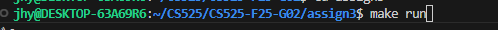

# CS525-F25-G02 Assignment 3 (not finished yet)

## 1. File Introduction

For this assignment, the main modifications were made to the following files:
- **Makefile**  
- **record_mgr.c**  
- **README.md**

### Overview of Files in the Project

1. **Makefile**  
   Used to compile the project. It builds the test binaries (`test_assign3_1`) from their respective `.c` files, together with the common sources. It also provides targets for compilation, execution, and cleanup.

2. **record_mgr.c**  
   Implements the Record Manager API specified in `record_mgr.h`. It handles table creation, record insertion/deletion/update, schema serialization, and tuple scanning.
   
3. **buffer_mgr.c / buffer_mgr.h**  
   These files from the 2nd assignment provid the buffer pool layer used by the record manager to read and write pages. 

4. **storage_mgr.c / storage_mgr.h**
   These files from the 1st assignment provide the underlying storage layer. Implements the page-level file I/O operations.

5. **dberror.c / dberror.h**  
   Utility files for error handling. They define error codes and provide helper functions for printing and debugging error messages.

6. **expr.c / expr.h**  
   Implements the expression evaluation `evalExpr` used by table scans.
   
7. **tables.h**  
   Provide the `Schema`, `Record` and other structures and utility functions for attribute handling.

8. **test_assign3_1.c**  
   Contains provided test cases for verifying the implementation, including creation, insertion, update, scan tests. The Makefile compiles these files into the test executable.

9. **test_helper.h**  
   A helper header file used by `test_assign3_1.c` for testing convenience. It provides macros and utility functions to simplify writing and running tests.

10. **README.md**  
   This document. It describes the solution, design, and instructions for building and running the project.

## 2. Design and Implementation of Functions

### 2.1 Core Design

- Page 0: Metadata (num tuples, first free page, and serialized schema)
- Pages 1 – N: Actual records, where each slot is 1 byte (tag) + recordSize bytes (data)

#### Key Structures

typedef struct TableMgmtData {
    BM_BufferPool *bm;
    int numTuples;
} TableMgmtData;

typedef struct RM_PageInfo {
    int freeSlots;  
} RM_PageInfo;

typedef struct ScanMgmtData {
    int currentPage;
    int currentSlot;
    Expr *cond;
    BM_PageHandle ph;
} ScanMgmtData;

### 2.2 Function Descriptions

#### Initialization and Shutdown 

1. **initRecordManager** : Initializes global state.

2. **shutdownRecordManager** : Cleans up resources.

#### Table Management

1. **createTable** : Creates a page file, initializes metadata on page 0 (numTuples=0), and writes a serialized schema string.
2. **openTable** : Opens the table, reads page 0, parses the schema string back, and initializes a buffer pool.
3. **closeTable** :  Flushes and shuts down the buffer pool and frees memory.
4. **deleteTable** : Deletes the table file.
5. **getNumTuples** : Returns `numTuples` stored in `TableMgmtData`

#### Record Operations

1. **createRecord** : Allocates a new record and data buffer.
2. **freeRecord** : Frees its memory.
3. **insertRecord** : Scans pages to find an empty slot, writes record data, marks dirty, and updates RID.
4. **deleteRecord** : Sets slot tag to '0' and clears data.
5. **updateRecord** : Rewrites record data at its RID.
6. **getRecord** : Fetches record data if slot tag is '1'. Includes a boundary check to avoid out-of-range access.

#### Attribute Access

1. **getAttr** : Reads a field from record data based on type and offset.
2. **setAttr** : Writes a field into record data. Both perform type-based offset calculation and handle STRING lengths.
 
#### Scanning Tuples

1. **startScan** : Initializes `ScanMgmtData`.
2. **next** : Iterates through pages and slots; for each tag ‘1’ record, calls `evalExpr()` to check `cond`.
3. **closeScan** : Unpins any pinned page and frees scan metadata.

### 2.3 Error and Boundary Handling

- Every major function starts with null pointer checks.
- Functions using page handles (pinPage) add unpin calls before early returns to avoid leaks.
- `getRecord()` and `updateRecord()` contain boundary checks (offset + slotSize > PAGE_SIZE) to avoid segfaults.

### 2.4 Supporting Functions

1. **parseSchemaString** : Reconstructs `Schema` from serialized metadata.
2. **serializeSchema** : Defined in rm_serializer.c. Generates the schema string for page 0. **TODOTODOTODOTODO**
   
## 3. How to Build and Run

### Prerequisites
- **Linux / macOS**  
  Requires `gcc` and `make` (these are usually pre-installed or can be installed easily with package managers such as `apt` or `yum`).

- **Windows**  
  In our setup, we use **WSL (Windows Subsystem for Linux)** with Ubuntu as the development environment.  
  This allows us to run `gcc` and `make` just like on Linux.  

  Example of using WSL and running `make` inside WSL:  

  !

### Build Instructions
1. Open a terminal (Linux/macOS) or a WSL terminal (Windows).
2. Navigate to the project directory:
   ```bash
   cd CS525-F25-G02/assign3
   ```

3. Run the following command to build the executable:

   ```bash
   make
   ```

   This compiles the source files and generates the executable **`test_assign3_1`**.

### Run Tests:
Builds the project and executes the test cases.

#### Using make
Run the main test case:
   ```bash
   make run
   ```
#### Run executables directly
Run test:

   ```bash
   ./test_assign3_1
   ```

### Additional Targets

1. **Clean build files**

  ```bash
  make clean
  ```

## 4. Design Highlights and Improvements

1. **Safe Pin/Unpin Mechanism** – Every `pinPage()` has a matching `unpinPage()` even in error branches.

2. **Record Tagging** – Each slot uses a 1-byte flag ('1' = valid, '0' = free).

3. **Schema Serialization** – Schema is stored as a single string on page 0 and reconstructed with `strtok()`.

4. **Full Test Compatibility** – All tests from `test_assign3_1.c` pass.

5. **Robust Boundary Checks** – Prevent page overflow and leakage when invalid RID is given.

## 5. Demonstration of Execution

This section demonstrates how to build, run, and clean the project.  
All commands are executed inside the project directory (`/CS525/CS525-F25-G02/assign2`) using WSL.

### Step 1: Navigate to the project folder
Before compiling, make sure you are inside the `assign2` folder of the repository.

```bash
cd CS525/
cd CS525-F25-G02/
cd assign3
```
!


### Step 2: Build the project with `make`

Run the following command to compile the source code:

```bash
make
```
This will build all object files (`.o`) and generate executables for the test cases (`test_assign3_1`).

!


### Step 3: Execute the test programs using the run targets

There are **two ways** to run the tests:

   #### Option A. Use `make run` Targets

   The Makefile defines custom targets for running each test case:

   ```bash
   make run    # runs test_assign3_1
   ```

   <p align="left">
      
   </p>


   #### Option B. Run Executables Directly

   You can also execute the compiled binaries directly:

   ```bash
   ./test_assign3_1
   ```

   !


### Step 4: Clean build files

To remove all compiled files and reset the build environment, run:

```bash
make clean
```
This deletes all object files and executables so you can rebuild from scratch.

!


## 5. Video Link

  [The link to the recorded assignment 3 demo video. ](https://www.loom.com/share/)

## 6. Contact Authors

* **Hongyi Jiang** (A20506636)
* **Naicheng Wei** (A20278475)

If you have any questions, feel free to contact us at: **[jiangxiaobai1142@gmail.com](mailto:jiangxiaobai1142@gmail.com)** **[lwei3@ghawk.illinoistech.edu](mailto:lwei3@ghawk.illinoistech.edu)**
